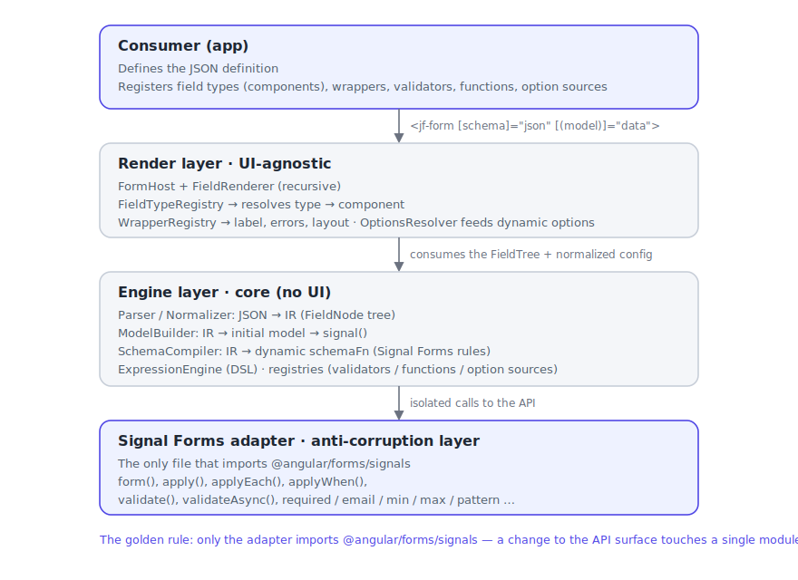

# Architecture & scope — JSON-driven dynamic forms library on Angular Signal Forms

> Target Angular: v22+ · Core API: `@angular/forms/signals` (**stable** since Angular v22, released June 2026)
> Living design document: it captures the decisions behind the library and is updated as it evolves.

---

## 1. Vision & goals

Build an Angular library that generates **dynamic forms from a JSON definition**, using **Signal Forms** as the state and validation engine — in the spirit of Formly or jsonforms.io, but native to the signal-based forms API.

Guiding goals:

1. **Data-driven.** The form's structure, validation and behavior are described in JSON; rendering is derived from it.
2. **UI-kit agnostic.** The core does not depend on Material, PrimeNG or any component kit. Integration with a kit happens through a **field-type registry** that the consumer fills in.
3. **Faithful to Signal Forms.** State, reactivity and validation are managed by Signal Forms; the library is an *interpreter* that translates JSON → `form()` + `schema`. It does not reimplement anything the platform already provides.
4. **A single integration point with the platform.** Every call into `@angular/forms/signals` lives behind an adapter (anti-corruption layer), so that any change to that API surface is handled in one module rather than scattered across the codebase.

Non-goals (for the current scope): a visual form builder, persistence of definitions, full end-to-end i18n (left as an extension point), and support for classic Reactive Forms.

---

## 2. The central tension of the project

Signal Forms is designed for structures that are **typed at compile time**:

```ts
const model = signal({ name: '', age: 0 });        // shape known at compile time
const f = form(model, (path) => {                   // path is typed from the model
  required(path.name);
  min(path.age, 18);
});
```

`form(model, schemaFn)` derives the whole structure from the **typed model**, and `schemaFn` receives a `SchemaPathTree` whose paths (`path.name`, `path.age`) are static, type-safe properties.

Our project inverts that flow: the model's shape is **not known until runtime**, when the JSON arrives. This frames the foundational architectural decision:

> **We need a runtime interpreter that, from the JSON, (a) builds the initial model object and its `signal`, and (b) dynamically generates the `schema` function by invoking Signal Forms rules over paths resolved at runtime.**

This is viable because, although the paths lose static typing, **Signal Forms' path tree is navigable at runtime by key**: `path['name']` works just like `path.name`. We accept losing type safety *inside the engine* (we work with `Record<string, unknown>`) and reintroduce it **optionally** at the public boundary via generics, for consumers that do know their shape.

### Consequences the design must respect

- **The model is the source of truth.** Signal Forms is model-driven: there is no `field.set()`. Changing a value, or adding/removing array items, means updating the model `signal` immutably. The library exposes helpers to mutate by path.
- **Stable structure, dynamic visibility.** Rebuilding `form()` is expensive and resets state. The recommended pattern is therefore to declare the **superset** of fields in the model and use `hidden()`/`disabled()` for conditional behavior, instead of adding/removing model fields on the fly.
- **`FieldTree` vs `FieldState`.** In templates and logic we must distinguish the structural node (`form.name`, used for `[formField]`) from the state (`form.name()`, which yields `.value()`, `.valid()`, `.touched()`…). The renderer and utilities must respect that distinction.

---

## 3. Layered architecture



The golden rule: **only the adapter layer imports `@angular/forms/signals`.** The rest of the code works against our own interfaces. If Angular renames `validateAsync` or changes the signature of `applyWhen`, it is fixed in one place.

---

## 4. JSON format (custom hybrid model)

A custom format inspired by Formly (an ergonomic field tree) and jsonforms.io (an explicit declaration of the data type, so the model can be **reconstructed**). A field declares its `dataType` precisely so the `ModelBuilder` knows which initial value to use (`''`, `0`, `false`, `[]`, `{}`) — Signal Forms forbids `null`/`undefined` as initial values.

```jsonc
{
  "version": "1",
  "id": "user-registration",
  "fields": [
    {
      "key": "email",
      "type": "text",            // UI type → resolved by the FieldTypeRegistry
      "dataType": "string",      // data type → used by the ModelBuilder
      "label": "Email",
      "props": { "placeholder": "you@example.com", "autocomplete": "email" },
      "validators": [
        { "kind": "required", "message": "Email is required" },
        { "kind": "email", "message": "Invalid email" }
      ],
      "asyncValidators": [
        { "kind": "uniqueEmail", "debounce": 300 }   // resolved by the registry
      ]
    },
    {
      "key": "age",
      "type": "number",
      "dataType": "number",
      "label": "Age",
      "validators": [
        { "kind": "required" },
        { "kind": "min", "value": 18, "message": "You must be of legal age" }
      ]
    },
    {
      "key": "password",
      "type": "password",
      "dataType": "string",
      "label": "Password",
      "validators": [{ "kind": "minLength", "value": 8 }]
    },
    {
      "key": "confirmPassword",
      "type": "password",
      "dataType": "string",
      "label": "Confirm password",
      "validators": [
        // Cross-field validation: DSL for the simple cases…
        { "kind": "expr", "expr": "value === model.password",
          "message": "Passwords do not match" }
      ]
    }
  ]
}
```

Format notes:

- `key` maps to the property in the model; nested groups are expressed with `type: "group"` + `fields`, and arrays with `type: "array"` + `item`.
- `type` (UI) and `dataType` (data) are deliberately **separated**: the same `dataType: "string"` can be rendered as `text`, `textarea`, `select` or `radio`.
- `validators[]` is a declarative list; each entry has a `kind` that the `SchemaCompiler` maps to a Signal Forms rule (standard) or to a registry entry (custom / cross-field / async).
- Conditional logic (visibility, disabled, dynamic required) is expressed with the hybrid model in section 6.

---

## 5. The engine: from JSON to `form()`

Four steps, all in the engine layer.

**5.1. Parser / Normalizer → IR.** Validates the JSON (against a *meta-schema* — Standard Schema / Zod validates the definition itself) and normalizes it to an internal representation (`FieldNode[]`) with absolute paths computed (`['address','street']`), resolved defaults and normalized validators. Definition errors are caught early here, with clear messages.

**5.2. ModelBuilder → initial object → `signal`.** Walks the IR and builds the nested model object, choosing the initial value by `dataType` (or `defaultValue` when provided). Result: `signal(initialModel)`.

```ts
function buildInitialModel(nodes: FieldNode[]): Record<string, unknown> {
  const out: Record<string, unknown> = {};
  for (const n of nodes) {
    if (n.kind === 'group') out[n.key] = buildInitialModel(n.children);
    else if (n.kind === 'array') out[n.key] = n.defaultValue ?? [];
    else out[n.key] = n.defaultValue ?? defaultFor(n.dataType); // ''/0/false
  }
  return out;
}
```

**5.3. SchemaCompiler → dynamic `schemaFn`.** Generates the function that `form()` runs once. It walks the IR and, for each node, resolves its path at runtime and applies rules. The key piece is **path resolution by key**:

```ts
const resolvePath = (root: any, keys: string[]) => keys.reduce((p, k) => p[k], root);

function compileSchema(nodes: FieldNode[], deps: Deps) {
  return (path: any) => {
    for (const n of nodes) {
      const p = resolvePath(path, n.path);

      // 1) standard validators → native rules (via the adapter)
      for (const v of n.validators) deps.applyStandardValidator(p, v);

      // 2) custom / cross-field validators → registry + validate()
      for (const v of n.customValidators) deps.applyCustomValidator(p, v, path);

      // 3) async validators → validateAsync() (always via the registry)
      for (const v of n.asyncValidators) deps.applyAsyncValidator(p, v);

      // 4) conditional logic → hidden/disabled/readonly with a compiled condition
      // 5) groups → recursion;  arrays → applyEach(p, compileSchema(item))
    }
  };
}
```

**5.4. Assembly.** `form(model, schemaFn, { injector })`. The low-level API returns `{ form, model }` and the `FieldTree` is handed to the renderer.

Standard validators map directly onto the real API:

| `kind` in JSON | Signal Forms rule |
|---|---|
| `required` (supports `when`) | `required(path, { message, when })` |
| `email` | `email(path, { message })` |
| `min` / `max` | `min(path, value)` / `max(path, value)` |
| `minLength` / `maxLength` | `minLength(path, value)` / `maxLength(path, value)` |
| `pattern` | `pattern(path, regExp)` |
| `expr` (cross-field/custom) | `validate(path, ctx => …)` using `value`, `valueOf`, `stateOf` |
| async (`uniqueEmail`, …) | `validateAsync(path, { params, factory, onSuccess, onError })` |

> Important API detail: the `when` option **exists only on `required`**. For any other conditional validator you must wrap it with `applyWhen(path, condition, schemaFn)`. The compiler handles this automatically.

---

## 6. Hybrid dynamic logic (DSL + registry)

Two complementary mechanisms:

**Expression DSL (for the simple cases).** For common conditions (`model.age >= 18`, `value !== ''`, `model.type === 'US'`) we use a small expression language **without `eval`**: parsing to a safe AST (`jsep`) and our own evaluator that exposes only a controlled context: `value` (the current field's value), `model` (a model snapshot) and helpers. Upside: the JSON is fully self-contained and serializable.

```jsonc
{ "kind": "expr", "expr": "value === model.password", "message": "Does not match" }
{ "hidden": { "expr": "model.tier === 'economy'" } }
{ "disabled": { "expr": "!model.createAccount" } }
```

The DSL compiles to a function that, inside the schema, reads other fields via `valueOf`/`stateOf`, respecting Signal Forms' reactive tracking:

```ts
// expr "model.age >= 18" →
hidden(path.extras, ({ valueOf }) => evalExpr(ast, { model: readModel(valueOf) }));
```

**TS function registry (for the complex cases).** When a condition does not fit an expression (computations, service access, business logic), the JSON references a function by key that the consumer registered:

```jsonc
{ "hidden": { "fn": "shouldHideShipping" } }
{ "kind": "fn", "fn": "validatePasswordStrength", "message": "Weak password" }
```

```ts
provideJsonForms({
  functions: {
    shouldHideShipping: (ctx) => ctx.value().sameAsBilling === true,
  },
});
```

**Design rule:** **async validation always goes through the registry**, never the DSL. A `validateAsync` needs a `resource`/HTTP call with `params`, `factory`, `onSuccess` and `onError` (the last one **required** by the API) — none of which is serializable in JSON. The JSON only references the `kind`; the implementation lives in the registry.

```ts
provideJsonForms({
  asyncValidators: {
    uniqueEmail: {
      params: ({ value }) => value(),
      factory: (email) => resource({ params: email, loader: ({ params }) => api.check(params) }),
      onSuccess: (taken) => taken ? { kind: 'taken', message: 'Already exists' } : undefined,
      onError: () => ({ kind: 'error', message: 'Could not validate' }),
    },
  },
});
```

---

## 7. UI-kit-agnostic component integration

The core knows about no widget. Integration happens through registries and a recursive renderer.

**FieldTypeRegistry.** Maps `type` (a string from the JSON) → an Angular component. The consumer fills it in, choosing their kit:

```ts
provideJsonForms({
  fieldTypes: {
    text:     MatTextFieldComponent,   // or PrimeNG, or plain HTML…
    number:   MatNumberFieldComponent,
    select:   MatSelectFieldComponent,
    checkbox: MatCheckboxFieldComponent,
  },
});
```

Each field component implements a minimal contract and receives the **`FieldTree` node** (to bind `[formField]` and read state) plus the field config:

```ts
export interface FieldComponent {
  field: FieldTree<unknown>;   // structural node → [formField]="field"
  config: FieldConfig;         // label, props, type…
  options?: Signal<OptionsState>;  // present only for fields with dynamic options
}
```

```html
<!-- example from a Material adapter -->
<mat-form-field>
  <mat-label>{{ config.label }}</mat-label>
  <input matInput [formField]="field" [placeholder]="config.props?.placeholder ?? ''" />
  @if (field().touched() && field().errors().length) {
    <mat-error>{{ field().errors()[0].message }}</mat-error>
  }
</mat-form-field>
```

**FieldRenderer (recursive).** A component that walks the IR and, for each field, dynamically instantiates the resolved registry component (via `NgComponentOutlet`), injects the matching `FieldTree` node, and wraps it with the applicable wrapper(s). For groups it recurses; for arrays it iterates with `@for`.

**WrapperRegistry (optional).** Reusable wrappers for label + errors + layout, in the style of Formly's *field wrappers*, to avoid repeating the scaffolding in every component. Wrappers can be **stacked** (`"wrapper": ["card", "default"]`) — see section 13.3.

**Result:** the same JSON definition renders with Material, PrimeNG, Tailwind or plain HTML just by swapping the registry. The core stays untouched.

---

## 8. Validation

- **Standard:** `required`, `email`, `min`, `max`, `minLength`, `maxLength`, `pattern`, mapped 1:1 from `validators[]` (section 5, table).
- **Cross-field:** via `validate()` reading other fields with `valueOf`/`stateOf`. Expressible by DSL (`value === model.password`) or by a registered function. It compiles onto the path of the field that shows the error.
- **Definition-level:** before compiling, the JSON is validated against a meta-schema (Standard Schema/Zod) to catch configuration errors early with clear messages.
- **Async:** via `validateAsync()` with `resource`, always from the registry. Supports `debounce` declared in the JSON (the library applies `debounce(path, ms)`).
- **Errors:** exposed exactly as Signal Forms returns them (`field().errors()` → `{ kind, message }[]`); the renderer/wrapper decides how to show them. i18n extension point: resolve `message` against a per-`kind` dictionary.

---

## 9. Project structure (Angular monorepo)

```
JsonForms/                         (ng workspace, ng-packagr)
├─ projects/
│  ├─ signal-jsonforms/            ← CORE LIBRARY (UI-agnostic)
│  │  ├─ core/        parser, IR, ModelBuilder, SchemaCompiler, OptionsResolver
│  │  ├─ adapter/     the only dependency on @angular/forms/signals
│  │  ├─ expression/  DSL (parser + safe evaluator)
│  │  ├─ registry/    FieldType / Wrapper / Validator / Function / OptionSource
│  │  ├─ render/      FormHost + FieldRenderer
│  │  └─ public-api.ts
│  ├─ signal-jsonforms-material/   ← optional ADAPTER (Angular Material)
│  ├─ signal-jsonforms-html/       ← optional ADAPTER (plain HTML)
│  └─ demo/                        ← examples & playground app
└─ DESIGN.md
```

The core has no dependency on UI kits; adapters ship as separate packages. Package names: `signal-jsonforms` (core) + `signal-jsonforms-material` / `signal-jsonforms-html` (reference adapters).

---

## 10. Public API

**Configuration (DI, standalone-first):**

```ts
bootstrapApplication(App, {
  providers: [
    provideJsonForms({
      fieldTypes,        // type → component
      wrappers,          // optional wrappers
      defaultWrapper,    // wrapper key applied to controls by default
      functions,         // function registry (complex logic)
      validators,        // custom synchronous validators
      asyncValidators,   // async validators
      optionSources,     // async option sources (cascading selects)
      messages,          // (optional) i18n by kind
      migrations,        // (optional) upgrade older definitions on load
    }),
  ],
});
```

**Declarative use (high level):**

```html
<jf-form [schema]="jsonConfig" [(model)]="data" #f="jfForm">
  <button [disabled]="f.invalid() || f.form()().pending()">Save</button>
</jf-form>
```

**Programmatic use (low level), for those who want the `FieldTree` directly:**

```ts
const { form, model } = buildSignalForm(jsonConfig, { injector, registries });
```

---

## 11. Roadmap by phase

| Phase | Content | Status |
|---|---|---|
| **0 — Scaffolding** | ng workspace + core library + reference Material adapter + demo | Done |
| **1 — MVP** | Basic fields, standard validators, **cross-field**, **nested groups + arrays (`applyEach`)**, **conditional visibility / `disabled` / `readonly` (DSL + registry)**, field-type registry, **JSON definition validation (Zod)** | Done |
| **1.5 — Async** | **Async validation (`validateAsync`)** + declarative `debounce` | Done |
| **2 — Integrations** | Plain-HTML adapter, wrapper system + pending indicator, per-form kit override, layout (column grids + collapsible sections) | Done |
| **3 — Advanced** | Centralized i18n messages, derived/`computed` fields (incl. inside array items), migration/serialization | Done |
| **4 — Coverage** | Dynamic/async options (cascading), multi-step wizard, plus quick wins (stacked wrappers, `clearOnHide`) — see section 13 | In progress |

---

## 12. Risks & open decisions

1. **API surface changes across majors.** Signal Forms is stable as of Angular v22, but its surface can still evolve across major releases. Mitigation: a single adapter layer + a pinned Angular version + a contract test suite against the API.
2. **Loss of typing inside the engine.** The interpreter works with `Record<string, unknown>`. Mitigation: validate the definition with a meta-schema and offer optional generics at the public boundary.
3. **DSL reactivity.** The evaluator must read dependencies via `valueOf`/`stateOf` so Signal Forms recomputes; a flat model snapshot would break tracking. Requires careful design of the DSL↔context bridge.
4. **Dynamic structure vs state.** Adding/removing model fields on the fly resets the form. Recommended policy: declare the superset + `hidden()`. For arrays, mutate the model (not the form).
5. **DSL safety.** No `eval`/`Function`. A bounded AST and an explicit context.

**Settled decisions:**
- **Package names:** `signal-jsonforms` (core) + `signal-jsonforms-material` / `signal-jsonforms-html` (reference adapters).
- **Definition validation:** yes, from **v1**, with Zod (a meta-schema validates the JSON before compiling and gives early, clear errors).
- **Reference adapter:** **Angular Material**, the framework's reference kit. The demo is built on it.

---

## 13. Phase 4 — Coverage

> Motivation: with the core complete (fields, validation, dynamic logic, computed, layout, i18n, migration), the two most visible gaps against Formly and SurveyJS are **dynamic/async options in selects** and **multi-step forms (wizard)**. This phase covers both, plus two quick wins that remove real friction (stackable `wrappers` and `clearOnHide`).

### 13.0 Inherited guiding principle

We keep the rule from section 2: **the model is the stable superset of every field**, `form()` is built once, and everything dynamic (visibility, steps, options) is a **reactive / render layer** on top — not a rebuild of the form. This holds for the wizard (it partitions the existing tree; it does not create per-step models) and for options (resolved outside the `SchemaCompiler`, because Signal Forms does not manage a select's option catalog).

---

### 13.1 Dynamic & async options (cascading selects) — implemented

**Problem.** Today a `select`'s options live statically in `props.options`. Real use cases need options **derived** from another field (country → city) and options **loaded asynchronously** (resource/HTTP), usually depending on another value.

**Key decision.** Options are **not** a validation concern, so they **do not go through the `SchemaCompiler`**. They are resolved in a separate unit (`OptionsResolver`) that produces a `Signal<OptionsState>` per field, which the renderer injects into the field component. This keeps Signal Forms the single source of truth for the *value*, with options as reactive presentation.

**New types (`core/model.ts`):**

```ts
export interface OptionItem {
  value: unknown;
  label: string;
  disabled?: boolean;
}

/** Four declarative ways to populate a field's options. */
export type OptionsConfig =
  | OptionItem[]                                   // static, inline
  | { expr: string }                              // derived (DSL): evaluates to OptionItem[]
  | { fn: string }                                // derived (registered function)
  | { source: string; debounce?: number };        // async, via the registry (resource)

export interface FieldConfig {
  // …existing…
  options?: OptionsConfig;
  /** If the current value leaves the resolved options, reset it (cascading). */
  clearOnOptionsChange?: boolean;
}
```

**New types (`registry/types.ts`):**

```ts
/** Async option source; same shape as AsyncValidatorDef. */
export interface OptionSourceDef {
  /** Reactive inputs (e.g. another field's value) → the resource params. */
  params: (ctx: DynamicContext) => unknown;
  /** Builds the resource from the params Signal. */
  factory: (input: Signal<unknown>) => unknown;
  /** Maps the loader result to the option list. */
  map: (result: unknown) => OptionItem[];
}

export interface JsonFormsConfig {
  // …existing…
  optionSources?: Record<string, OptionSourceDef>;
}

/** Reactive state a field component consumes to render the select. */
export interface OptionsState {
  loading: boolean;
  options: OptionItem[];
  error?: unknown;
}
```

**Resolution (`OptionsResolver`).** For each field with `options`:

- `OptionItem[]` → a constant `signal({ loading: false, options })`.
- `{ expr }` / `{ fn }` → a `computed()` evaluated against the model (reuses `ExpressionEngine` / the function registry, like `computed` in phase 3). Synchronous, no `loading`.
- `{ source }` → looks up `optionSources[source]`, calls `factory(params)` inside the injector, optionally applies `debounce`, and exposes `loading/options/error` derived from the resource state. Same mental model as `validateAsync`.

**Cascading + clearing.** When `clearOnOptionsChange` is on, an `effect` watches the resolved options; if the current value is not among them, it writes the default into the model (the same `updateIn` mechanism used by `setupComputedFields`). So country→city clears a stale city.

**Scope.** Supported on static-path fields (top-level + groups), like `computed`/`clearOnHide`. Array-item fields are not handled (dynamic paths); static inline option arrays still work there because the field reads them from its config.

**Example JSON:**

```jsonc
{ "key": "country", "type": "select", "dataType": "string",
  "options": [ { "value": "es", "label": "Spain" }, { "value": "us", "label": "United States" } ] }

{ "key": "city", "type": "select", "dataType": "string",
  "clearOnOptionsChange": true,
  "options": { "source": "citiesByCountry", "debounce": 200 } }
```

```ts
provideJsonForms({
  optionSources: {
    citiesByCountry: {
      params: (ctx) => ctx.valueAt('country'),
      factory: (country) => resource({ params: country, loader: ({ params }) => api.cities(params) }),
      map: (rows) => (rows as any[]).map((r) => ({ value: r.id, label: r.name })),
    },
  },
});
```

---

### 13.2 Multi-step forms (wizard)

**Problem.** Onboarding, surveys and long sign-ups are split into steps with navigation and per-step validation. There is no way to express that today.

**Key decision.** The wizard is a **render layer**, not an engine one. The model stays flat and is the superset of every field across every step; `form()` is built once over the whole tree. A step is just a **presentational partition** of the top-level nodes. A step's validity is **derived** from its fields' `FieldState` (`field().valid()`); there are no sub-forms.

**New types (`core/model.ts`):**

```ts
export interface StepConfig {
  id?: string;
  label?: string;
  description?: string;
  fields: FieldConfig[];
  /** Step conditionally skipped (DSL or function). */
  skipWhen?: DynamicExpr;
}

export interface WizardConfig {
  /** true (default): cannot advance while the current step is invalid. */
  linear?: boolean;
  /** Renders the default stepper / header. */
  showStepper?: boolean;
}

export interface FormConfig {
  version?: string;
  id?: string;
  layout?: LayoutConfig;
  fields?: FieldConfig[];     // becomes optional…
  steps?: StepConfig[];       // …mutually exclusive with `fields`: if present, steps win
  wizard?: WizardConfig;
}
```

**Normalization.** The `Normalizer` flattens `steps[].fields` into the usual `FieldNode` list (top-level paths, no step prefix → the model shape doesn't change), and stores a `stepIndex: { step: StepConfig; nodeKeys: string[] }[]` map in `FormDefinition`. The `SchemaCompiler` and `ModelBuilder` are unaware of steps. The meta-validation (Zod) accepts `steps` **or** `fields`, not both.

**`JfWizard` component (render layer, kit-agnostic).** Signal-based state:

- `currentStep: WritableSignal<number>`, skipping steps whose `skipWhen` is true.
- `stepValid(i): Signal<boolean>` = every field in step `i` is valid (derived from `FieldState`).
- `next()` → if `linear` and the current step is invalid, mark its fields `touched` and don't advance; otherwise move to the next visible step. `prev()`, `goTo(i)` (in `linear`, only to already-completed steps).
- `isLast`, `isFirst`, `progress` computed.
- `submit()` fires from the last step (reusing the existing async `submit()` on `FormHost`).

The default stepper is **structural and unstyled** (classes `jf-step`, `jf-step-active`, `jf-step-done` for theming), like today's `.jf-group`/`.jf-array`. An adapter could later offer a `mat-stepper`-based one. The default navigation (Prev/Next/Submit) is rendered but **replaceable**: `<jf-form>` exposes the wizard state via its `exportAs` (`#f="jfForm"` → `f.wizard`) so consumers can build their own buttons.

**Example JSON:**

```jsonc
{
  "version": "1",
  "wizard": { "linear": true, "showStepper": true },
  "steps": [
    { "id": "account", "label": "Account",
      "fields": [ { "key": "email", "type": "text", "validators": [ { "kind": "required" } ] } ] },
    { "id": "profile", "label": "Profile",
      "skipWhen": { "expr": "model.kind === 'guest'" },
      "fields": [ { "key": "fullName", "type": "text" } ] }
  ]
}
```

---

### 13.3 Quick wins — implemented

**Stackable wrappers.** `wrapper?: string` becomes `wrapper?: string | string[]`. The `FieldRenderer` nests them outside-in (`['card','validation']` → `card` wraps `validation` wraps the field). Backward compatible: a string is treated as a list of one. To support stacking, a custom wrapper must render the threaded-in `inner` component with its `innerInputs` (the next wrapper, or the control).

**`clearOnHide`.** New `FieldConfig.clearOnHide?: boolean`. When the field's `hidden` condition becomes true, an `effect` resets its value to the default in the model (reading the hidden state from the compiled form tree, then `updateIn`). The reset fires only on the visible→hidden edge, which avoids object-identity loops on group resets. Prevents a hidden field from polluting the `submit`. Defaults to `false` (current behavior: the value is kept).

---

### 13.4 Out of scope for this phase

Interop with standard JSON Schema, renderer selection by *tester*/ranking, per-field lifecycle hooks, an *error summary* panel, and the visual drag-and-drop builder. To be considered in a later phase. **Recommended cross-cutting note:** introduce `vitest` over the core (`ModelBuilder`, `SchemaCompiler`, `OptionsResolver`, `steps` normalization) during this phase, so each new feature ships with tests rather than as debt — verification stops depending on manual Node scripts.

### 13.5 API impact summary

| Area | Change | Backward compatible |
|---|---|---|
| `model.ts` | `OptionItem`, `OptionsConfig`, `FieldConfig.options`, `clearOnOptionsChange`, `clearOnHide`, `StepConfig`, `WizardConfig`, `FormConfig.steps/wizard`, optional `fields`, `wrapper: string \| string[]` | Yes (all additive / widened) |
| `registry/types.ts` | `OptionSourceDef`, `OptionsState`, `JsonFormsConfig.optionSources` | Yes |
| `field-component.interface.ts` | `options?: Signal<OptionsState>` | Yes (optional) |
| `render/` | `JfWizard`, default stepper, `FormHost` exposes `wizard` | Yes (only active when `steps` is present) |
| new `core/` | `OptionsResolver` | Yes |
